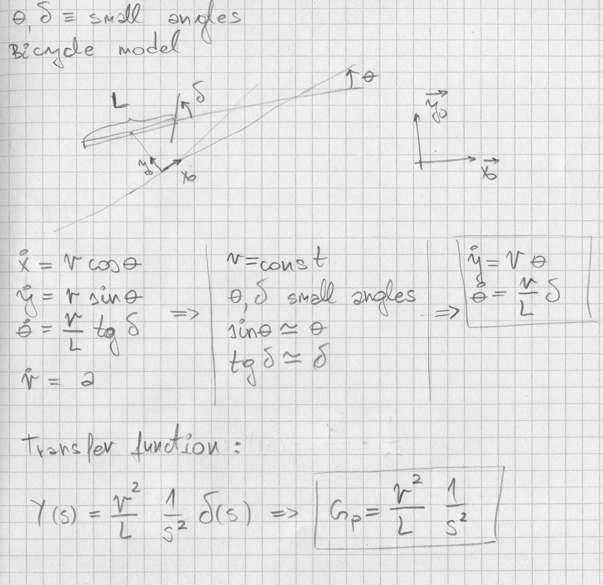
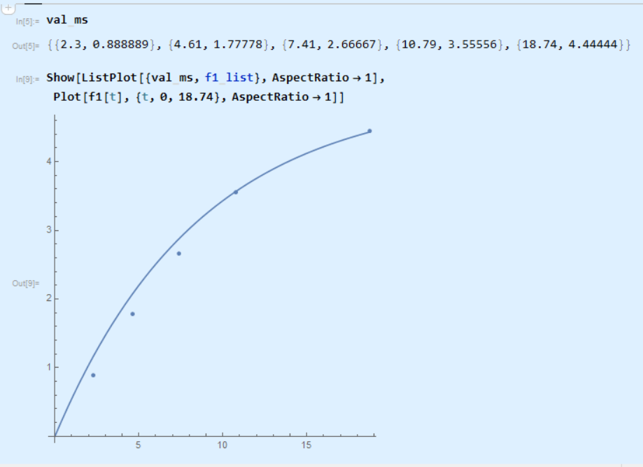
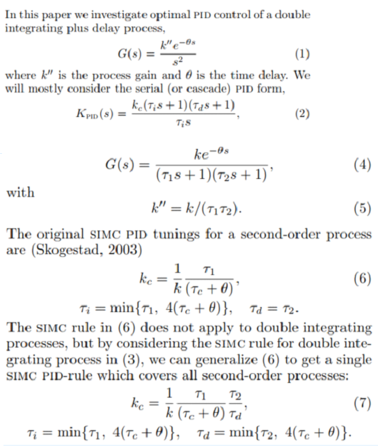

# Description of the project solution

## Creating car models as a basis for choosing the PID parameters

Instead of using the twiddle tunning for the PID parameters, I chose to try using model based approach. Since from the simulator itself it looks like the car model could be represented as a simple bycicle model, I used it as a base for deriving the transfer functions models for the car. These transfer functions were then used as input models for PID parameterization.

I have prepared a simple sketch that describes how the transfer function model was derived from the kinetic bicycle model:

So if the curvature of the trajectory at any given point is small relative to the cte (or y coordinate value), and for small values of angle (theta) and (delta), the approximated linear model should quite accurately represent the behavior of the system. Of course, the speed (V) should also be maintained at some given value, but it will be shown this task is not so difficult. Unknown parameter in the model is the drive axle distance L, but this parameter could be guessed or the correction could be made based on the performance of the regulation.

So the model that describes the CTE based on the input angle (delta), given constant speed (V) and assumed distance (L) is:

    Gp(s) = V^2/L * 1/s^2

So we have only one unknown parameter, and that is distance (L).

For the speed regulation, I have tried to make a model based on the experiments from the simulator. I tried to map how the vehicle speed changes when the throttle is kept at the same level (which it turned out was somewhat dificult). It turned out that the vehicle speed can be mapped to exponential function, which is a typical response of the first order transfer function.

The variable (val_ms) represents the times and the speed values in [m/s], taken when the throttle is exactly 0.1 and kept at that level. I had then tried to test the linearity of the throttle model by doubling the throttle, and as expected the speeds over same time were very approximately doubled as well. So, the linear model for the speed was chossen to be:

    Gv(s) = 50/(8.62 * s + 1)

It is important here to acknowledge that the model does not need to be 100% accurate representation of the system, since one of the actual roles of the PID control is to tolerate certain deviation from the modeled behavior.

So, in summary, the control is independently divided to the control of the speed and control of the CTE. The role of the speed controller is to make transition to the setpoint speed quickly enough so that CTE model could work in the vicinity of its linearization point.

## Choosing PID parameters

PID parameters were chosen according to the transfer function models explained in the previous paragraph. Since these are continuous time models, they needed to be transformed to the discrete domain. To do that, one needs to know the sample time which will be used to update the models and obtain the outputs. Experimentaly I have discovered that sensor data arrives with the cycle of approximately (0.1s), so this value was chosen as sample time. This discretization is performed in the actual implementation of the PID algorithm, so it is not relevant for the further reading.

### PID parameters for speed regulation

Since the speed model is simple first order transfer function, there are many different ways to setup PID regulation. One way would be to use "Technical optimum" where the integral constant would be chosen to be equal to the process dominant time constant (here it would be Ti = 8.62). Just as an exercise I have chosen a different approach, where I could set the Ti to increase the disturbance rejection, which would also translate to greater tolerance in model/system perturbations. So the parameters were chosen by setting the dominant time constant by dividing direct transfer function characteristic polynomial with the desired pole:

    Kp = (Ti * (Ta - Tu))/(K * (Ti - Tu) * Tu)
    Ta = 8.62, K = 50, Tu = 2/2.4 (rise time 2s)

And Ti was set experimentaly to (Ta / 5) which improved disturbance rejection compared to what technical optimum would achieve (Ti = Ta). It is also important to notice that derivative action was not used (Td = 0) since it is not necessary with systems like these.

### PID parameters for CTE regulation

Since we have double integrating process to regulate, the choice of PID parameters is a much more difficult task compared with speed model parameterization. Also, it can be proven that PID regulation without the derivative action (Td = 0) in fact, can not be used to stabilize such a process! However, there are some general techniques that can be used in cases like these, and one of them SIMC parameterization (I refere to the paper https://www.sciencedirect.com/science/article/pii/S2405896316304359 where SIMC is explained). The SIMC is eplained in these excerpts from the paper:

SIMC rule can be used for calculating PID parameters for any process up to second order, but is best used for the second order and processes that have at least one pure integrator. Since for our model we have (theta = 0, tau1 = 0, tau2 = 0), we endup with having only two parameters for tweaking, gain K and parameter tau_c. The initial value for K was of course chosen as the value (V^2 / L), and afterwards I tried tweaking K and tau_c to gain desired response in the simulator.

### Finishing remarks

To obtain better performance of the regulation, one possibility would be to use additional measurements, such as the angle position of the car (theta). That would enable to use cascade PID control with 2 loops, where the inner, faster loop would regulate (theta), and outer loop would regulate CTE by controlling the setpoint for theta loop. Such control would undoubtedly provide much better performance. It is also possible that even without such explicit measurement, value for theta could be obtained by using some sort of observer model based on the linearized bicycle model.

Other ways are possible of course, such as using some sub-optimal control on the exact model such as MPC or other.
